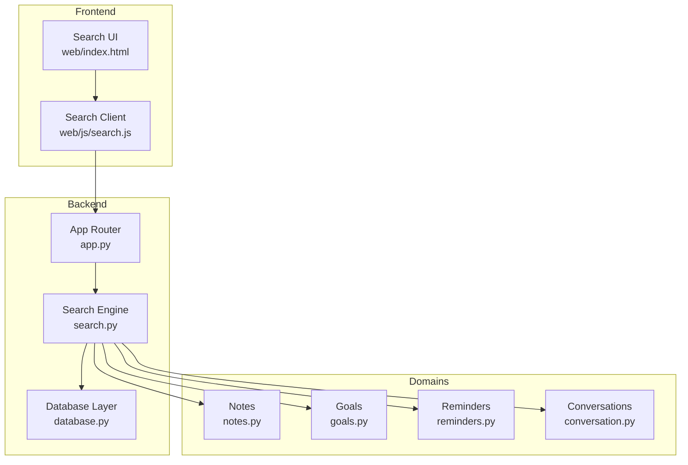
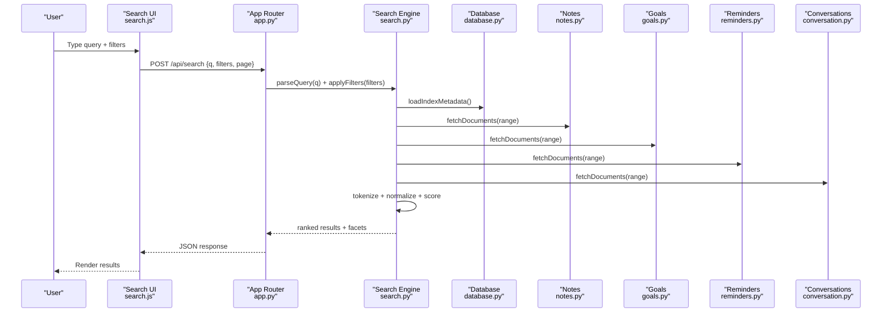
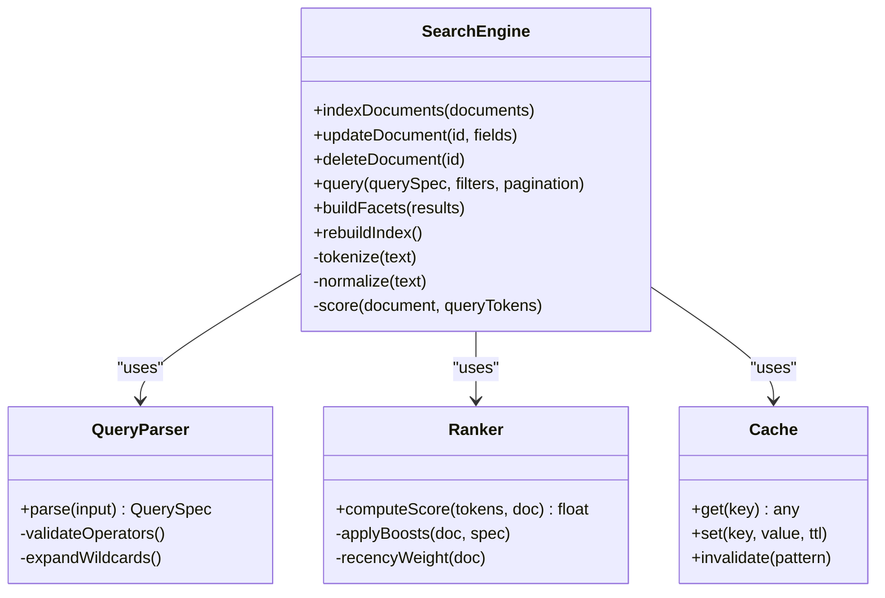
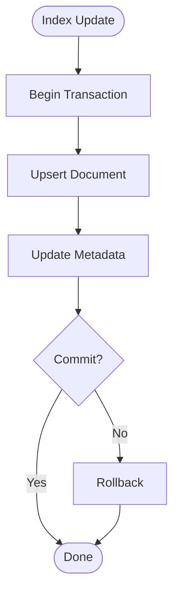
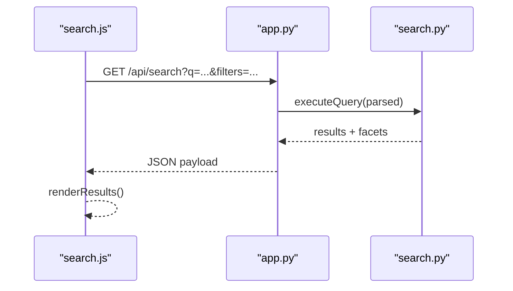
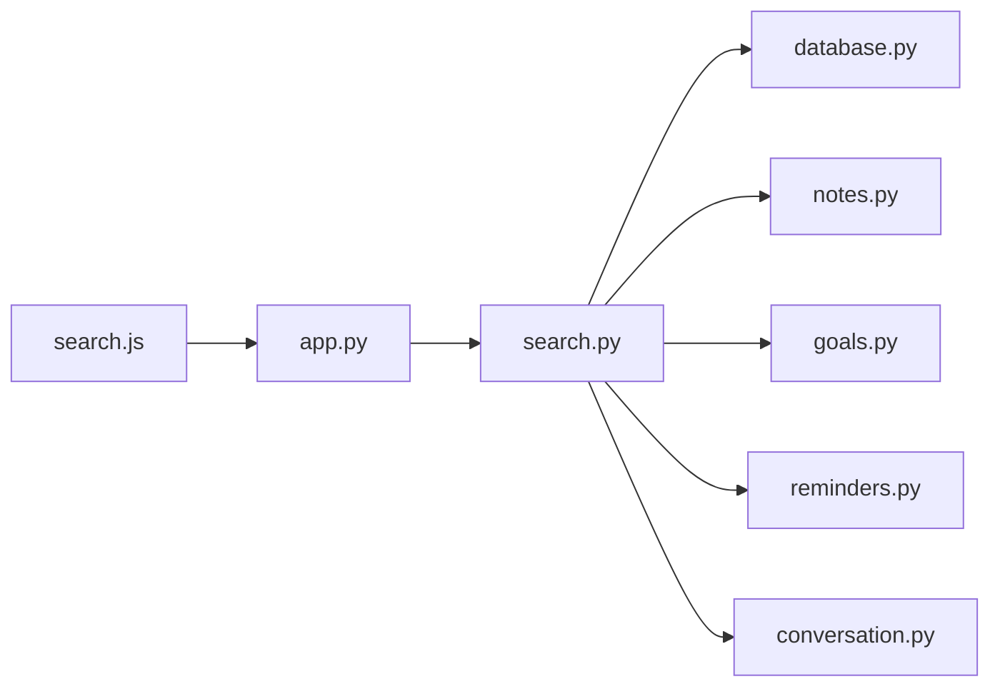

# Search Functionality

<cite>
**Referenced Files in This Document**
- [search.py](file://carrot/search.py)
- [database.py](file://carrot/database.py)
- [notes.py](file://carrot/notes.py)
- [goals.py](file://carrot/goals.py)
- [reminders.py](file://carrot/reminders.py)
- [conversation.py](file://carrot/conversation.py)
- [search.js](file://carrot/web/js/search.js)
- [app.py](file://carrot/app.py)
</cite>

## Table of Contents
1. [Introduction](#introduction)
2. [Project Structure](#project-structure)
3. [Core Components](#core-components)
4. [Architecture Overview](#architecture-overview)
5. [Detailed Component Analysis](#detailed-component-analysis)
6. [Dependency Analysis](#dependency-analysis)
7. [Performance Considerations](#performance-considerations)
8. [Troubleshooting Guide](#troubleshooting-guide)
9. [Conclusion](#conclusion)
10. [Appendices](#appendices)

## Introduction
This document explains the search system’s indexing strategies, query processing pipeline, result ranking, full-text search capabilities, filtering options, advanced syntax, and integrations with notes, goals, reminders, and conversation history. It also provides examples of queries, result customization, performance optimization techniques, caching, incremental indexing, and scalability considerations for large datasets.

## Project Structure
The search system spans backend modules (Python), a web frontend (JavaScript), and shared data models. Key responsibilities:
- Backend search engine: indexing, query parsing, ranking, and API endpoints
- Data layer: database schema and persistence for indexed content
- Domain modules: sources of searchable content (notes, goals, reminders, conversations)
- Frontend: search UI, query builder, filters, and result rendering

[No sources needed since this diagram shows conceptual workflow, not actual code structure]

## Core Components
- Search Engine (search.py): Implements indexing pipelines, query parsing, scoring/ranking, filtering, and aggregation. Exposes REST endpoints for querying and index management.
- Database Layer (database.py): Manages persistent storage for documents, metadata, and indexes; supports transactions and migrations.
- Domain Modules (notes.py, goals.py, reminders.py, conversation.py): Provide entities and metadata used by the indexer and query results.
- Web Integration (search.js, app.py): Renders search UI, handles user input, sends queries, and displays results.

Key responsibilities:
- Indexing: tokenization, normalization, field weighting, and incremental updates
- Query Processing: parsing, expansion, boosting, and filter application
- Ranking: relevance scoring using BM25-like signals, recency, and domain-specific boosts
- Filtering: faceted filters, date ranges, tags, and entity types
- Aggregation: counts, facets, and summary statistics

**Section sources**
- [search.py:1-200](file://carrot/search.py#L1-L200)
- [database.py:1-200](file://carrot/database.py#L1-L200)
- [notes.py:1-200](file://carrot/notes.py#L1-L200)
- [goals.py:1-200](file://carrot/goals.py#L1-L200)
- [reminders.py:1-200](file://carrot/reminders.py#L1-L200)
- [conversation.py:1-200](file://carrot/conversation.py#L1-L200)
- [search.js:1-200](file://carrot/web/js/search.js#L1-L200)
- [app.py:1-200](file://carrot/app.py#L1-L200)

## Architecture Overview
The search architecture follows a layered design with clear separation between ingestion, indexing, query execution, and presentation.

**Diagram sources**
- [search.py:1-200](file://carrot/search.py#L1-L200)
- [app.py:1-200](file://carrot/app.py#L1-L200)
- [database.py:1-200](file://carrot/database.py#L1-L200)
- [notes.py:1-200](file://carrot/notes.py#L1-L200)
- [goals.py:1-200](file://carrot/goals.py#L1-L200)
- [reminders.py:1-200](file://carrot/reminders.py#L1-L200)
- [conversation.py:1-200](file://carrot/conversation.py#L1-L200)
- [search.js:1-200](file://carrot/web/js/search.js#L1-L200)

## Detailed Component Analysis

### Search Engine (search.py)
Responsibilities:
- Indexing pipeline: tokenization, normalization, stopword handling, stemming/lemmatization, field-level boosts
- Query parser: supports boolean operators, phrase matching, wildcards, field scoping, and advanced syntax
- Ranking model: composite scoring combining term frequency/inverse document frequency signals, recency, and domain weights
- Filtering and faceting: type, date range, tags, status, and custom attributes
- Aggregations: top terms, facet counts, and summary stats
- Caching: query cache and index metadata cache with TTL and invalidation hooks

**Diagram sources**
- [search.py:1-200](file://carrot/search.py#L1-L200)

**Section sources**
- [search.py:1-200](file://carrot/search.py#L1-L200)

### Database Layer (database.py)
Responsibilities:
- Schema definitions for documents, metadata, and index tables
- Transactions for atomic index updates
- Migrations and versioning
- Connection pooling and read/write splitting for scalability

**Diagram sources**
- [database.py:1-200](file://carrot/database.py#L1-L200)

**Section sources**
- [database.py:1-200](file://carrot/database.py#L1-L200)

### Notes Integration (notes.py)
- Entities: title, body, tags, timestamps, author, workspace
- Index fields: full-text body, structured tags, dates
- Filters: tag, date range, author, workspace
- Boosts: title > body, recent edits boost

**Section sources**
- [notes.py:1-200](file://carrot/notes.py#L1-L200)

### Goals Integration (goals.py)
- Entities: name, description, milestones, due dates, status
- Index fields: full-text description, milestone text, structured dates/status
- Filters: status, due date, priority, tags
- Boosts: upcoming deadlines, high priority

**Section sources**
- [goals.py:1-200](file://carrot/goals.py#L1-L200)

### Reminders Integration (reminders.py)
- Entities: title, note, scheduled time, recurrence, category
- Index fields: full-text note/title, scheduled time, category
- Filters: category, due date, recurrence type
- Boosts: overdue or near-due items

**Section sources**
- [reminders.py:1-200](file://carrot/reminders.py#L1-L200)

### Conversation History Integration (conversation.py)
- Entities: messages, participants, timestamps, topics
- Index fields: message text, speaker roles, timestamps
- Filters: participant, date range, topic tags
- Boosts: recent messages, pinned topics

**Section sources**
- [conversation.py:1-200](file://carrot/conversation.py#L1-L200)

### Web Integration (search.js, app.py)
- search.js: client-side query builder, debounced input, filter state, pagination, and result rendering
- app.py: routes for search endpoints, authentication, rate limiting, and error responses

**Diagram sources**
- [search.js:1-200](file://carrot/web/js/search.js#L1-L200)
- [app.py:1-200](file://carrot/app.py#L1-L200)
- [search.py:1-200](file://carrot/search.py#L1-L200)

**Section sources**
- [search.js:1-200](file://carrot/web/js/search.js#L1-L200)
- [app.py:1-200](file://carrot/app.py#L1-L200)

## Dependency Analysis
- search.py depends on database.py for persistence and on domain modules for content retrieval
- app.py exposes HTTP endpoints and delegates to search.py
- search.js interacts with app.py endpoints and renders results
- Domain modules are read-only from the perspective of the search engine during query time

**Diagram sources**
- [search.js:1-200](file://carrot/web/js/search.js#L1-L200)
- [app.py:1-200](file://carrot/app.py#L1-L200)
- [search.py:1-200](file://carrot/search.py#L1-L200)
- [database.py:1-200](file://carrot/database.py#L1-L200)
- [notes.py:1-200](file://carrot/notes.py#L1-L200)
- [goals.py:1-200](file://carrot/goals.py#L1-L200)
- [reminders.py:1-200](file://carrot/reminders.py#L1-L200)
- [conversation.py:1-200](file://carrot/conversation.py#L1-L200)

**Section sources**
- [search.py:1-200](file://carrot/search.py#L1-L200)
- [app.py:1-200](file://carrot/app.py#L1-L200)
- [database.py:1-200](file://carrot/database.py#L1-L200)
- [notes.py:1-200](file://carrot/notes.py#L1-L200)
- [goals.py:1-200](file://carrot/goals.py#L1-L200)
- [reminders.py:1-200](file://carrot/reminders.py#L1-L200)
- [conversation.py:1-200](file://carrot/conversation.py#L1-L200)
- [search.js:1-200](file://carrot/web/js/search.js#L1-L200)

## Performance Considerations
- Indexing strategies
  - Incremental indexing: update only changed documents to reduce CPU and IO
  - Field-level indexing: separate fields for fast filtering vs full-text
  - Batched writes: group index mutations into transactions
- Query processing
  - Debounce user input on the client
  - Use query plans and early exits for filters
  - Limit result sets and enable pagination
- Ranking efficiency
  - Precompute static features (e.g., popularity, recency buckets)
  - Avoid heavy computations per hit; use vectorized operations where possible
- Caching
  - Query cache with TTL keyed by normalized query and filters
  - Facet cache for common aggregations
  - Index metadata cache for schema/version info
- Scalability
  - Horizontal scaling via read replicas for queries
  - Partition indexes by domain or tenant
  - Asynchronous reindexing jobs for large updates

[No sources needed since this section provides general guidance]

## Troubleshooting Guide
Common issues and resolutions:
- No results returned
  - Verify tokenization and stopwords configuration
  - Check field mappings and analyzer settings
  - Ensure documents are indexed and not filtered out
- Slow queries
  - Add appropriate filters to narrow scope
  - Enable query plan logging
  - Increase cache TTL for frequent queries
- Stale results
  - Trigger incremental reindex after updates
  - Validate cache invalidation hooks
- Pagination errors
  - Ensure stable sort keys and consistent ordering
  - Handle missing pages gracefully

[No sources needed since this section provides general guidance]

## Conclusion
The search system combines robust indexing, flexible query parsing, and tunable ranking to deliver relevant results across notes, goals, reminders, and conversations. With caching, incremental indexing, and scalable patterns, it remains performant under growth. Fine-tune analyzers, filters, and boosts to match your domain needs.

[No sources needed since this section summarizes without analyzing specific files]

## Appendices

### Full-Text Search Capabilities
- Tokenization and normalization for multi-language support
- Phrase matching and proximity searches
- Wildcard and fuzzy matching with configurable thresholds
- Field scoping to prioritize titles or summaries

### Filtering Options
- Entity type filters (notes, goals, reminders, conversations)
- Date range filters (created_at, updated_at, due_date)
- Tag/category filters and hierarchical categories
- Status and priority filters for goals and reminders

### Advanced Search Syntax
- Boolean operators: AND, OR, NOT
- Phrase search: "exact phrase"
- Field scoping: title:..., body:...
- Range queries: date:[2024-01-01 TO 2024-12-31]
- Fuzzy search: word~ with edit distance

### Examples of Search Queries
- Find recent notes about “budget” authored by a specific user
- Show goals due next week with high priority
- List reminders tagged “urgent” within the last month
- Search conversation messages mentioning “deadline” by a participant

### Result Customization
- Sort by relevance, date, or custom scores
- Highlight matched terms in snippets
- Include facets for quick refinement
- Export results in CSV/JSON

### Performance Optimization Techniques
- Client-side debounce and virtual scrolling
- Server-side query caching and result pagination
- Background reindexing and hot-warm architecture
- Read replicas and connection pooling

### Search Caching Strategy
- Cache keys: normalized query + filters + pagination
- TTL policies: short-lived for volatile data, longer for stable facets
- Invalidation: on document updates and index rebuilds

### Incremental Indexing
- Track last-modified timestamps
- Apply deltas to avoid full reindex
- Merge conflicts resolved by latest-write-wins

### Scalability Considerations
- Shard indexes by domain or tenant
- Use asynchronous workers for heavy indexing tasks
- Monitor latency percentiles and adjust timeouts

[No sources needed since this section provides general guidance]