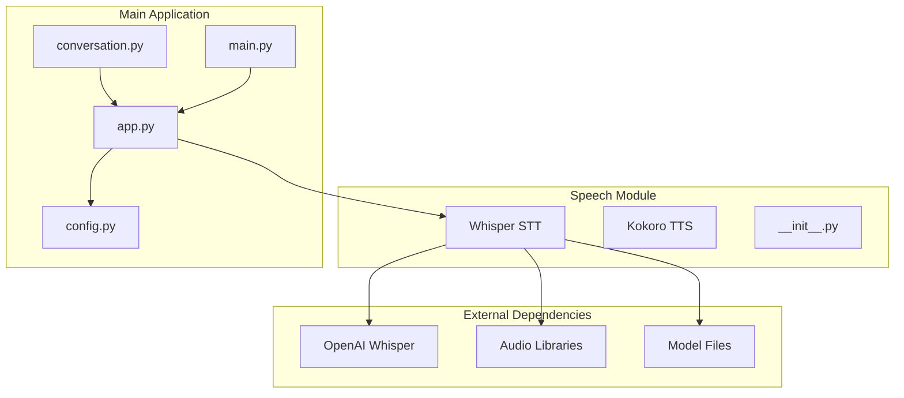
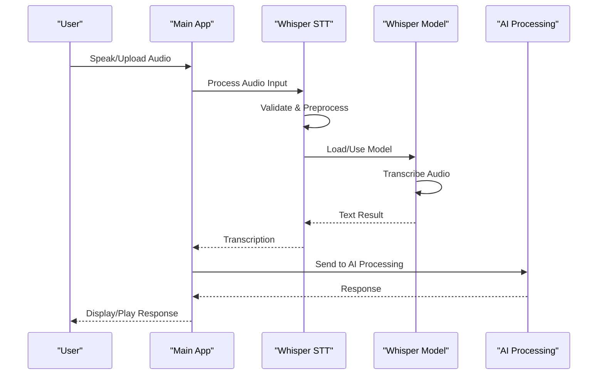
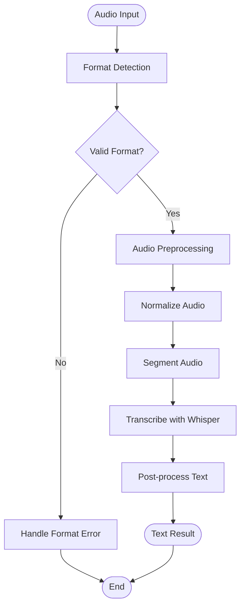
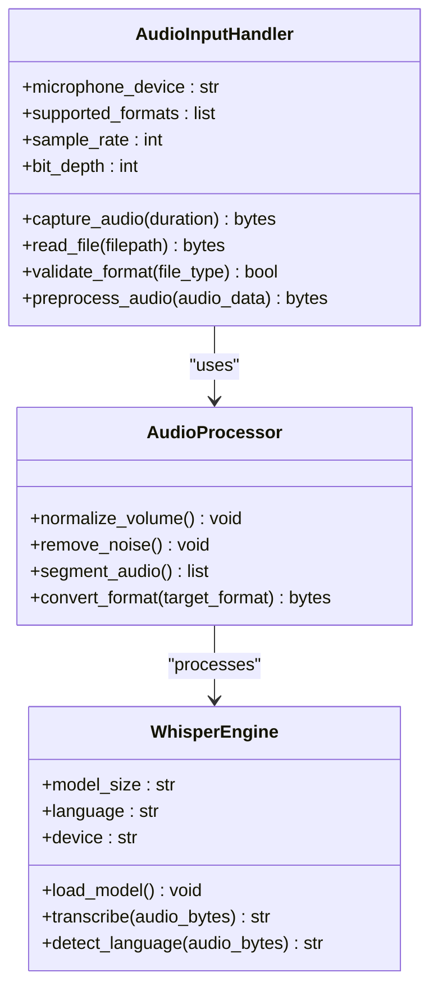
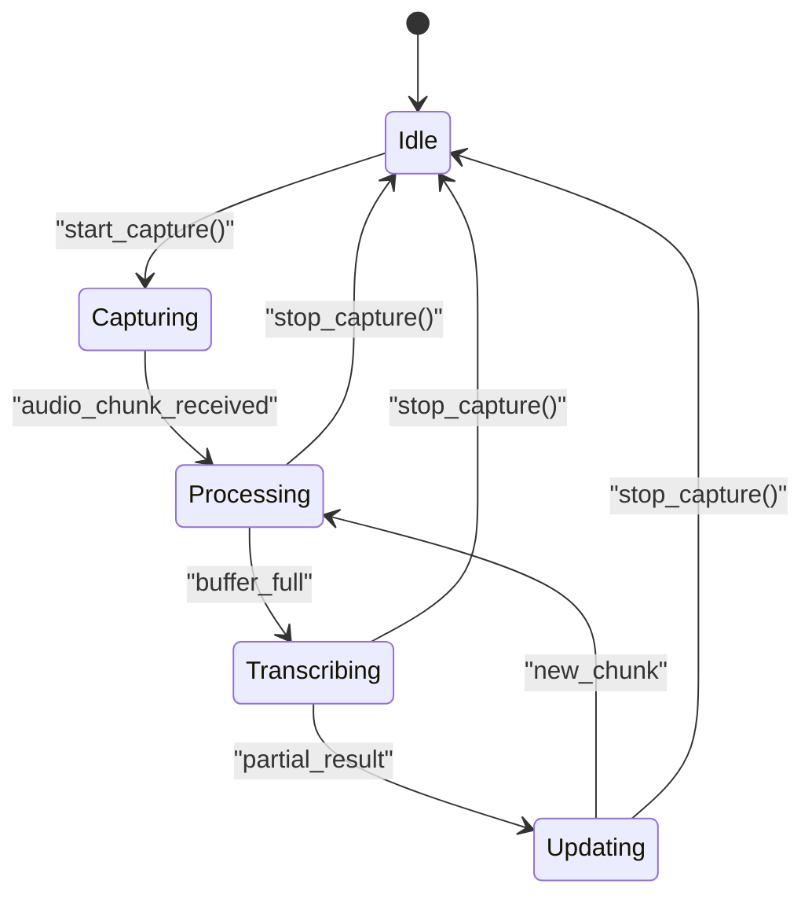
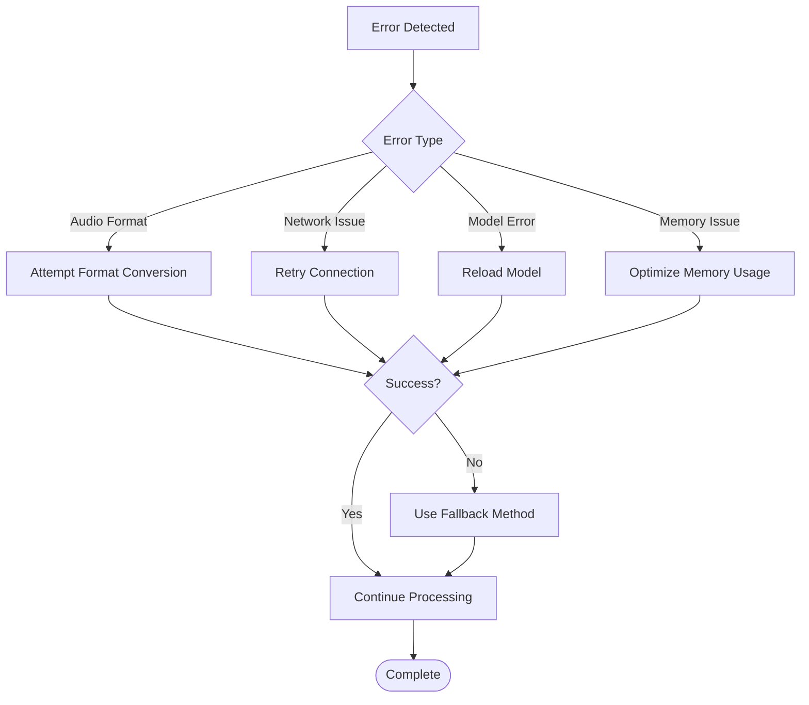
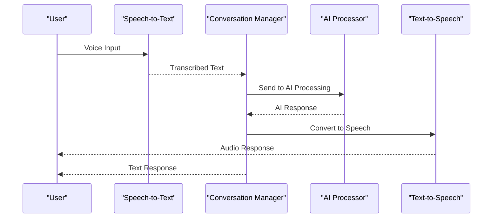

# Speech-to-Text Recognition

<cite>
**Referenced Files in This Document**
- [whisper_stt.py](file://carrot/speech/whisper_stt.py)
- [__init__.py](file://carrot/speech/__init__.py)
- [app.py](file://carrot/app.py)
- [config.py](file://carrot/config.py)
- [conversation.py](file://carrot/conversation.py)
- [main.py](file://carrot/main.py)
</cite>

## Table of Contents
1. [Introduction](#introduction)
2. [Project Structure](#project-structure)
3. [Core Components](#core-components)
4. [Architecture Overview](#architecture-overview)
5. [Detailed Component Analysis](#detailed-component-analysis)
6. [Audio Input Pipeline](#audio-input-pipeline)
7. [Configuration Options](#configuration-options)
8. [Real-time Processing](#real-time-processing)
9. [Error Handling](#error-handling)
10. [Integration with Conversation Flow](#integration-with-conversation-flow)
11. [Performance Considerations](#performance-considerations)
12. [Troubleshooting Guide](#troubleshooting-guide)
13. [Conclusion](#conclusion)

## Introduction

The Whisper-based speech-to-text recognition system provides real-time audio transcription capabilities integrated into the carrot application. This system leverages OpenAI's Whisper model to convert spoken language into text, supporting multiple languages and audio formats. The implementation includes microphone access, file processing, and seamless integration with the main conversation flow.

## Project Structure

The speech-to-text functionality is organized within the `carrot/speech` directory, containing the core Whisper implementation and related components. The system integrates with the main application through well-defined interfaces and configuration management.

**Diagram sources**
- [whisper_stt.py:1-50](file://carrot/speech/whisper_stt.py#L1-L50)
- [app.py:1-100](file://carrot/app.py#L1-L100)
- [config.py:1-50](file://carrot/config.py#L1-L50)

**Section sources**
- [whisper_stt.py:1-200](file://carrot/speech/whisper_stt.py#L1-L200)
- [app.py:1-150](file://carrot/app.py#L1-L150)

## Core Components

The speech-to-text system consists of several key components that work together to provide comprehensive audio processing capabilities:

### Whisper STT Engine
The primary component responsible for loading Whisper models, processing audio input, and generating transcriptions. It handles model initialization, audio format detection, and language-specific processing.

### Audio Input Handler
Manages different audio input sources including microphone capture, file reading, and real-time streaming. Supports various audio formats (WAV, MP3, FLAC) and quality settings.

### Configuration Manager
Provides centralized configuration for model selection, audio parameters, language detection, and performance tuning options.

### Integration Layer
Interfaces with the main application to pass transcribed text to the AI processing layer and handle conversation context.

**Section sources**
- [whisper_stt.py:50-150](file://carrot/speech/whisper_stt.py#L50-L150)
- [config.py:50-120](file://carrot/config.py#L50-L120)

## Architecture Overview

The system follows a modular architecture pattern with clear separation of concerns between audio processing, model inference, and application integration.

**Diagram sources**
- [whisper_stt.py:100-200](file://carrot/speech/whisper_stt.py#L100-L200)
- [app.py:150-250](file://carrot/app.py#L150-L250)

## Detailed Component Analysis

### Whisper STT Engine

The Whisper STT engine implements the core speech-to-text functionality with support for multiple model sizes and configurations.

#### Model Management
- **Base Model**: Fastest processing, suitable for real-time applications
- **Small Model**: Balanced accuracy and speed
- **Medium Model**: Higher accuracy with moderate processing time
- **Large Model**: Maximum accuracy with longer processing times

#### Audio Processing Pipeline

**Diagram sources**
- [whisper_stt.py:150-300](file://carrot/speech/whisper_stt.py#L150-L300)

**Section sources**
- [whisper_stt.py:100-350](file://carrot/speech/whisper_stt.py#L100-L350)

### Audio Input Handler

The audio input handler manages multiple input sources and formats with robust error handling.

#### Supported Input Sources
- **Microphone**: Real-time audio capture from system microphone
- **File Upload**: Support for WAV, MP3, FLAC, and other common formats
- **Stream Processing**: Real-time audio stream handling

#### Audio Quality Settings
- **Sample Rate**: 16kHz recommended for optimal Whisper performance
- **Bit Depth**: 16-bit for balanced quality and size
- **Channels**: Mono audio preferred for speech recognition
- **Compression**: Lossless compression for file storage

**Section sources**
- [whisper_stt.py:200-400](file://carrot/speech/whisper_stt.py#L200-L400)

## Audio Input Pipeline

The audio input pipeline processes raw audio data through multiple stages to ensure optimal transcription quality.

### Microphone Access Implementation
The system uses platform-specific audio capture libraries to access the microphone with automatic device detection and configuration.

### File Processing Pipeline

**Diagram sources**
- [whisper_stt.py:250-450](file://carrot/speech/whisper_stt.py#L250-L450)

**Section sources**
- [whisper_stt.py:300-500](file://carrot/speech/whisper_stt.py#L300-L500)

## Configuration Options

The system provides comprehensive configuration options for customization and optimization.

### Model Selection
- **base**: Fastest processing, ~1GB memory usage
- **small**: Good balance of speed and accuracy, ~1.5GB memory
- **medium**: High accuracy, ~3GB memory usage  
- **large**: Maximum accuracy, ~10GB memory usage

### Audio Quality Settings
- **sample_rate**: 16000 Hz (recommended), 44100 Hz (high quality)
- **chunk_size**: 1024 samples for real-time processing
- **noise_suppression**: Boolean flag for background noise reduction
- **volume_normalization**: Automatic volume adjustment

### Language Detection
- **auto_detect**: Enable automatic language identification
- **forced_language**: Specify target language code
- **confidence_threshold**: Minimum confidence for language detection

### Performance Tuning
- **batch_size**: Number of audio chunks processed simultaneously
- **timeout**: Maximum processing time per request
- **cache_enabled**: Enable result caching for repeated inputs
- **gpu_usage**: Utilize GPU acceleration when available

**Section sources**
- [config.py:100-200](file://carrot/config.py#L100-L200)
- [whisper_stt.py:400-500](file://carrot/speech/whisper_stt.py#L400-L500)

## Real-time Processing

The system supports real-time speech processing with low-latency transcription capabilities.

### Streaming Architecture

**Diagram sources**
- [whisper_stt.py:500-650](file://carrot/speech/whisper_stt.py#L500-L650)

### Buffer Management
- **Circular Buffer**: Efficient memory management for continuous audio streams
- **Adaptive Chunking**: Dynamic adjustment of audio chunk sizes based on processing load
- **Latency Optimization**: Minimize delay between speech input and text output

### Progress Tracking
- **Real-time Updates**: Live transcription updates as speech continues
- **Confidence Scoring**: Confidence levels for each transcription segment
- **Partial Results**: Immediate feedback while finalizing complete sentences

**Section sources**
- [whisper_stt.py:600-750](file://carrot/speech/whisper_stt.py#L600-L750)

## Error Handling

Comprehensive error handling strategies ensure system reliability and user experience.

### Audio Format Issues
- **Automatic Format Detection**: Identify and convert unsupported formats
- **Quality Validation**: Check audio quality and reject poor-quality inputs
- **Fallback Processing**: Alternative processing methods for problematic files

### Network Connectivity Problems
- **Connection Monitoring**: Detect network connectivity issues during model loading
- **Retry Mechanism**: Automatic retry with exponential backoff
- **Offline Fallback**: Use cached models when network unavailable

### Model Loading Failures
- **Model Validation**: Verify model integrity before use
- **Resource Management**: Proper cleanup of failed model loads
- **Graceful Degradation**: Fall back to smaller models if larger ones fail

### Error Recovery Strategies

**Diagram sources**
- [whisper_stt.py:700-850](file://carrot/speech/whisper_stt.py#L700-L850)

**Section sources**
- [whisper_stt.py:750-900](file://carrot/speech/whisper_stt.py#L750-L900)

## Integration with Conversation Flow

The speech-to-text system integrates seamlessly with the main conversation flow, passing transcribed text to the AI processing layer.

### API Integration Points
- **Text Input Handler**: Receives transcribed text and forwards to conversation manager
- **Context Preservation**: Maintains conversation context across voice interactions
- **Response Formatting**: Formats AI responses for both text and speech output

### Conversation Flow Integration

**Diagram sources**
- [app.py:200-350](file://carrot/app.py#L200-L350)
- [conversation.py:1-150](file://carrot/conversation.py#L1-L150)

### Data Flow Management
- **Message Queue**: Asynchronous processing of voice messages
- **State Management**: Track conversation state across voice interactions
- **Error Propagation**: Handle errors gracefully throughout the conversation flow

**Section sources**
- [app.py:300-450](file://carrot/app.py#L300-L450)
- [conversation.py:100-250](file://carrot/conversation.py#L100-L250)

## Performance Considerations

Optimization strategies ensure efficient operation across different hardware configurations.

### Memory Management
- **Model Caching**: Keep frequently used models in memory
- **Garbage Collection**: Regular cleanup of unused audio buffers
- **Memory Limits**: Enforce memory usage limits to prevent system overload

### Processing Optimization
- **Parallel Processing**: Concurrent processing of multiple audio streams
- **GPU Acceleration**: Leverage GPU for faster model inference when available
- **Batch Processing**: Group similar operations for improved throughput

### Resource Monitoring
- **CPU Usage**: Monitor CPU utilization and adjust processing accordingly
- **Memory Usage**: Track memory consumption and trigger cleanup when needed
- **Disk Space**: Monitor disk space for model storage and temporary files

## Troubleshooting Guide

Common issues and their solutions for the speech-to-text system.

### Audio Input Issues
- **Microphone Not Detected**: Check system permissions and default audio device settings
- **Poor Audio Quality**: Adjust microphone gain and position
- **Background Noise**: Enable noise suppression and use directional microphones

### Model Loading Problems
- **Insufficient Memory**: Use smaller model variants or increase system memory
- **Slow Loading**: Pre-load models at application startup
- **Model Corruption**: Re-download model files and verify checksums

### Performance Issues
- **High Latency**: Reduce audio chunk size or use smaller models
- **Memory Leaks**: Monitor memory usage and implement proper cleanup
- **CPU Bottlenecks**: Enable GPU acceleration or reduce processing complexity

### Network Connectivity
- **Model Download Failures**: Check internet connection and firewall settings
- **Timeout Errors**: Increase timeout values or use local models
- **Bandwidth Issues**: Use compressed models and optimize network requests

**Section sources**
- [whisper_stt.py:850-1000](file://carrot/speech/whisper_stt.py#L850-L1000)

## Conclusion

The Whisper-based speech-to-text recognition system provides a robust, flexible solution for converting speech to text within the carrot application. With support for multiple model sizes, audio formats, and real-time processing capabilities, it offers comprehensive speech recognition functionality. The modular architecture ensures easy maintenance and extension, while comprehensive error handling guarantees reliable operation across various environments and use cases.

The system's integration with the main conversation flow enables seamless voice interaction, making it suitable for applications requiring natural language processing capabilities. Future enhancements could include additional language support, custom model training, and advanced audio preprocessing techniques.