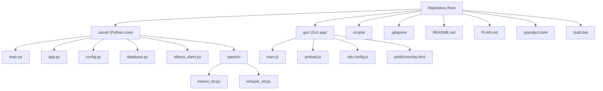
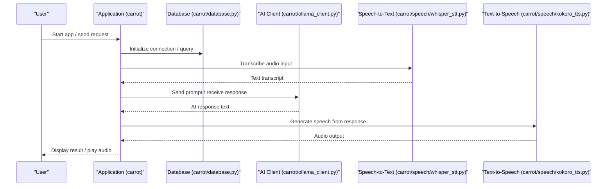

# Troubleshooting

<cite>
**Referenced Files in This Document**
- [README.md](file://README.md)
- [PLAN.md](file://PLAN.md)
- [pyproject.toml](file://pyproject.toml)
- [build.bat](file://build.bat)
- [carrot/main.py](file://carrot/main.py)
- [carrot/app.py](file://carrot/app.py)
- [carrot/config.py](file://carrot/config.py)
- [carrot/database.py](file://carrot/database.py)
- [carrot/ollama_client.py](file://carrot/ollama_client.py)
- [carrot/speech/kokoro_tts.py](file://carrot/speech/kokoro_tts.py)
- [carrot/speech/whisper_stt.py](file://carrot/speech/whisper_stt.py)
- [gui/main.js](file://gui/main.js)
- [gui/preload.js](file://gui/preload.js)
- [gui/vite.config.js](file://gui/vite.config.js)
- [gui/public/overlay.html](file://gui/public/overlay.html)
</cite>

## Table of Contents
1. Introduction
2. Project Structure
3. Core Components
4. Architecture Overview
5. Detailed Component Analysis
6. Dependency Analysis
7. Performance Considerations
8. Troubleshooting Guide
9. Conclusion
10. Appendices

## Introduction
This document provides comprehensive troubleshooting guidance for the project, focusing on common issues, error resolution, performance optimization, and diagnostic strategies. It covers installation problems, configuration errors, runtime failures, speech processing issues, AI integration challenges, and system automation problems. It also includes guidance for log analysis, debugging techniques, and community support channels.

## Project Structure
The project is a Python application with an optional GUI layer and web assets:
- Python core under carrot/: main entry points, configuration, database, AI client, speech modules, and feature modules.
- GUI under gui/: Electron-style app with preload script, Vite config, and public overlay.
- Build and packaging scripts at the repository root.

**Diagram sources**
- [README.md](file://README.md)
- [PLAN.md](file://PLAN.md)
- [pyproject.toml](file://pyproject.toml)
- [build.bat](file://build.bat)
- [carrot/main.py](file://carrot/main.py)
- [carrot/app.py](file://carrot/app.py)
- [carrot/config.py](file://carrot/config.py)
- [carrot/database.py](file://carrot/database.py)
- [carrot/ollama_client.py](file://carrot/ollama_client.py)
- [carrot/speech/kokoro_tts.py](file://carrot/speech/kokoro_tts.py)
- [carrot/speech/whisper_stt.py](file://carrot/speech/whisper_stt.py)
- [gui/main.js](file://gui/main.js)
- [gui/preload.js](file://gui/preload.js)
- [gui/vite.config.js](file://gui/vite.config.js)
- [gui/public/overlay.html](file://gui/public/overlay.html)

**Section sources**
- [README.md](file://README.md)
- [PLAN.md](file://PLAN.md)
- [pyproject.toml](file://pyproject.toml)
- [build.bat](file://build.bat)

## Core Components
Key components to focus on during troubleshooting:
- Application bootstrap and configuration: main.py, app.py, config.py
- Data persistence: database.py
- AI integration: ollama_client.py
- Speech pipeline: whisper_stt.py (STT), kokoro_tts.py (TTS)
- GUI runtime: main.js, preload.js, vite.config.js, overlay.html

Common failure points include environment setup, dependency installation, model availability, network connectivity, audio device access, and GUI build/runtime issues.

**Section sources**
- [carrot/main.py](file://carrot/main.py)
- [carrot/app.py](file://carrot/app.py)
- [carrot/config.py](file://carrot/config.py)
- [carrot/database.py](file://carrot/database.py)
- [carrot/ollama_client.py](file://carrot/ollama_client.py)
- [carrot/speech/whisper_stt.py](file://carrot/speech/whisper_stt.py)
- [carrot/speech/kokoro_tts.py](file://carrot/speech/kokoro_tts.py)
- [gui/main.js](file://gui/main.js)
- [gui/preload.js](file://gui/preload.js)
- [gui/vite.config.js](file://gui/vite.config.js)
- [gui/public/overlay.html](file://gui/public/overlay.html)

## Architecture Overview
High-level flow from user input to AI and speech outputs:

**Diagram sources**
- [carrot/app.py](file://carrot/app.py)
- [carrot/database.py](file://carrot/database.py)
- [carrot/ollama_client.py](file://carrot/ollama_client.py)
- [carrot/speech/whisper_stt.py](file://carrot/speech/whisper_stt.py)
- [carrot/speech/kokoro_tts.py](file://carrot/speech/kokoro_tts.py)

## Detailed Component Analysis

### Application Bootstrap and Configuration
Focus areas:
- Entry point initialization and argument parsing
- Configuration loading and validation
- Environment variables and defaults

Typical issues:
- Missing or invalid configuration keys
- Incorrect paths or permissions for config files
- Environment variable misconfiguration

Diagnostics:
- Verify configuration schema and defaults
- Inspect startup logs for missing keys or type mismatches
- Validate environment variables before launch

**Section sources**
- [carrot/main.py](file://carrot/main.py)
- [carrot/app.py](file://carrot/app.py)
- [carrot/config.py](file://carrot/config.py)

### Database Layer
Focus areas:
- Connection lifecycle and pooling
- Schema migrations and versioning
- Query performance and indexing

Typical issues:
- Connection timeouts or pool exhaustion
- Migration conflicts or missing tables
- Slow queries due to missing indexes

Diagnostics:
- Enable detailed logging for connection events
- Check migration status and rollback plans
- Profile slow queries and add appropriate indexes

**Section sources**
- [carrot/database.py](file://carrot/database.py)

### AI Integration (Ollama Client)
Focus areas:
- Model availability and versions
- Network connectivity and proxy settings
- Request/response payload formatting

Typical issues:
- Model not found or incompatible version
- Network errors or authentication failures
- Timeouts due to large payloads or slow endpoints

Diagnostics:
- Test endpoint reachability and credentials
- Validate model list and versions
- Log request/response sizes and durations

**Section sources**
- [carrot/ollama_client.py](file://carrot/ollama_client.py)

### Speech Processing (STT and TTS)
Focus areas:
- Audio capture and format compatibility
- Whisper model availability and GPU acceleration
- Kokoro TTS model and audio output devices

Typical issues:
- No audio input device detected
- Whisper model download failures or insufficient disk space
- TTS engine initialization errors or output device selection

Diagnostics:
- Verify audio device permissions and formats
- Ensure models are downloaded and accessible
- Test audio playback and recording independently

**Section sources**
- [carrot/speech/whisper_stt.py](file://carrot/speech/whisper_stt.py)
- [carrot/speech/kokoro_tts.py](file://carrot/speech/kokoro_tts.py)

### GUI Runtime
Focus areas:
- Node.js and dependencies installation
- Vite build process and asset paths
- Preload script security context and IPC

Typical issues:
- Missing Node.js or outdated versions
- Build failures due to dependency conflicts
- Preload sandbox restrictions blocking IPC calls

Diagnostics:
- Validate Node.js and npm versions
- Reinstall dependencies and rebuild assets
- Review preload security policies and IPC usage

**Section sources**
- [gui/main.js](file://gui/main.js)
- [gui/preload.js](file://gui/preload.js)
- [gui/vite.config.js](file://gui/vite.config.js)
- [gui/public/overlay.html](file://gui/public/overlay.html)

## Dependency Analysis
External dependencies and their roles:
- Python packages for AI, speech, and data layers
- Node.js ecosystem for GUI build and runtime
- System libraries for audio and GPU acceleration

Potential pitfalls:
- Version incompatibilities between Python packages
- Missing system dependencies for audio/GPU
- Outdated Node.js causing build/runtime failures

Mitigations:
- Pin dependency versions in pyproject.toml
- Use virtual environments and lockfiles
- Install system prerequisites per OS documentation

**Section sources**
- [pyproject.toml](file://pyproject.toml)

## Performance Considerations
Guidelines to improve responsiveness and resource usage:
- Optimize database queries and enable connection pooling
- Cache frequent AI responses where safe
- Stream audio inputs/outputs to reduce memory pressure
- Monitor CPU/GPU utilization and adjust model sizes
- Profile Python code paths with profiling tools

[No sources needed since this section provides general guidance]

## Troubleshooting Guide

### Installation Problems
Symptoms:
- Import errors or missing modules
- Build failures for GUI assets
- Incompatible Python or Node.js versions

Steps:
- Confirm Python and Node.js versions meet requirements
- Install dependencies using the project’s package manager
- Rebuild GUI assets if necessary
- Verify system prerequisites for audio and GPU features

**Section sources**
- [pyproject.toml](file://pyproject.toml)
- [build.bat](file://build.bat)
- [gui/vite.config.js](file://gui/vite.config.js)

### Configuration Errors
Symptoms:
- Startup crashes due to missing keys
- Invalid types or values in configuration
- Environment variables not applied

Steps:
- Validate configuration schema and defaults
- Check environment variables and file paths
- Restart the application after changes

**Section sources**
- [carrot/config.py](file://carrot/config.py)

### Runtime Issues
Symptoms:
- Database connection failures
- AI client timeouts or model errors
- Speech module initialization failures

Steps:
- Inspect logs for stack traces and error codes
- Test external services (AI endpoint, audio devices)
- Reset state by restarting services or clearing caches

**Section sources**
- [carrot/database.py](file://carrot/database.py)
- [carrot/ollama_client.py](file://carrot/ollama_client.py)
- [carrot/speech/whisper_stt.py](file://carrot/speech/whisper_stt.py)
- [carrot/speech/kokoro_tts.py](file://carrot/speech/kokoro_tts.py)

### Speech Processing Failures
Symptoms:
- No audio input detected
- Whisper transcription errors
- TTS generation failures

Steps:
- Verify audio device permissions and formats
- Ensure Whisper models are downloaded and accessible
- Test TTS engine with default settings
- Reduce sample rates or chunk sizes if memory is constrained

**Section sources**
- [carrot/speech/whisper_stt.py](file://carrot/speech/whisper_stt.py)
- [carrot/speech/kokoro_tts.py](file://carrot/speech/kokoro_tts.py)

### AI Integration Issues
Symptoms:
- Model not found or version mismatch
- Network errors or authentication failures
- Slow responses or timeouts

Steps:
- List available models and verify versions
- Test endpoint connectivity and credentials
- Adjust request payloads and timeouts
- Enable detailed logging for diagnostics

**Section sources**
- [carrot/ollama_client.py](file://carrot/ollama_client.py)

### System Automation Problems
Symptoms:
- Scheduled tasks not executing
- File path or permission errors
- Resource contention with other processes

Steps:
- Validate task schedules and cron entries
- Check file permissions and working directories
- Monitor resource usage and isolate conflicting processes

[No sources needed since this section provides general guidance]

### GUI Build/Runtime Issues
Symptoms:
- Build fails due to dependency conflicts
- Overlay not rendering or IPC errors
- Preload sandbox restrictions

Steps:
- Reinstall dependencies and rebuild assets
- Review vite configuration and asset paths
- Adjust preload security policies and IPC usage

**Section sources**
- [gui/main.js](file://gui/main.js)
- [gui/preload.js](file://gui/preload.js)
- [gui/vite.config.js](file://gui/vite.config.js)
- [gui/public/overlay.html](file://gui/public/overlay.html)

### Log Analysis Techniques
Recommended practices:
- Centralize logs with timestamps and levels
- Include context identifiers for requests and sessions
- Rotate logs and retain recent history
- Use structured logging for machine parsing

[No sources needed since this section provides general guidance]

### Debugging Strategies
Approaches:
- Reproduce issues in isolated environments
- Add targeted logging around failure points
- Use breakpoints and step-through debugging
- Instrument performance-critical paths

[No sources needed since this section provides general guidance]

### Community Resources and Support
Channels:
- Issue tracker for bug reports and feature requests
- Community forums and discussion boards
- Documentation updates and release notes

Reporting procedures:
- Provide minimal reproducible examples
- Include environment details and logs
- Follow contribution guidelines for patches

[No sources needed since this section provides general guidance]

## Conclusion
This guide consolidates common issues and resolutions across installation, configuration, runtime, speech processing, AI integration, and GUI components. By following the diagnostic steps and leveraging logs and profiling tools, most problems can be identified and resolved efficiently. For ongoing support, use the community channels and reporting procedures outlined above.

[No sources needed since this section summarizes without analyzing specific files]

## Appendices

### Quick Reference: Common Error Categories
- Environment setup: Python/Node versions, virtual environments, system dependencies
- Dependencies: version pinning, lockfiles, rebuilds
- Configuration: schema validation, environment variables, file paths
- Runtime: connections, timeouts, permissions
- Speech: audio devices, models, formats
- AI: models, endpoints, payloads
- GUI: builds, assets, preload policies

[No sources needed since this section provides general guidance]