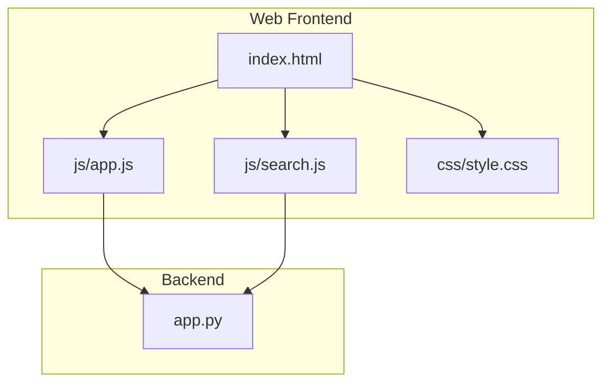
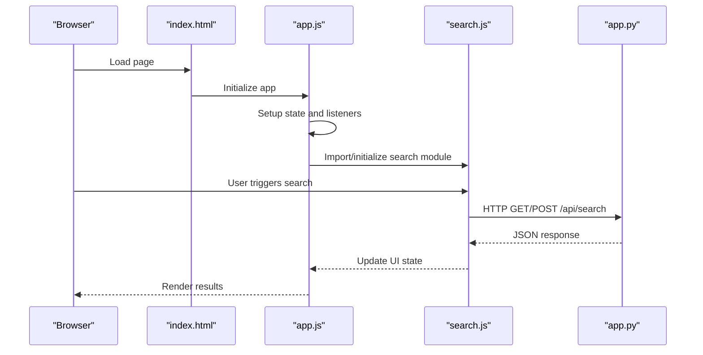
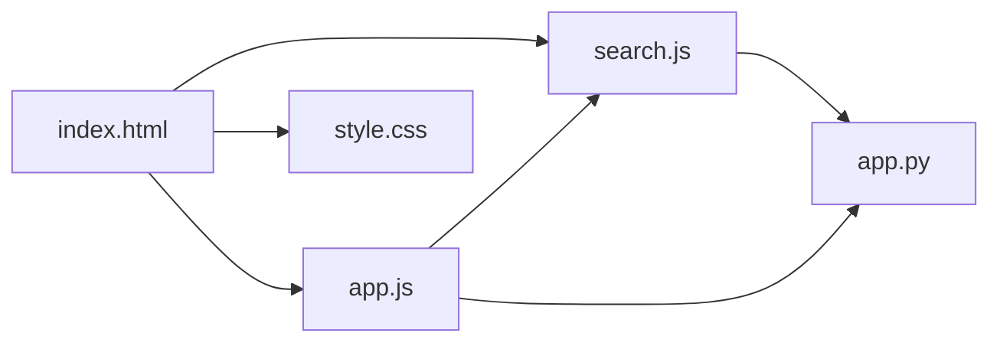

# Frontend Architecture

<cite>
**Referenced Files in This Document**
- [index.html](file://carrot/web/index.html)
- [app.js](file://carrot/web/js/app.js)
- [search.js](file://carrot/web/js/search.js)
- [style.css](file://carrot/web/css/style.css)
- [app.py](file://carrot/app.py)
</cite>

## Table of Contents
1. [Introduction](#introduction)
2. [Project Structure](#project-structure)
3. [Core Components](#core-components)
4. [Architecture Overview](#architecture-overview)
5. [Detailed Component Analysis](#detailed-component-analysis)
6. [Dependency Analysis](#dependency-analysis)
7. [Performance Considerations](#performance-considerations)
8. [Troubleshooting Guide](#troubleshooting-guide)
9. [Conclusion](#conclusion)

## Introduction
This document describes the web frontend architecture for the project, focusing on the HTML structure, JavaScript application initialization, and component organization within the web directory. It explains the main application flow, event handling patterns, state management approach, and how the frontend communicates with backend services. It also covers real-time update strategies and user interaction handling, with references to core functionality implementation, error handling strategies, and integration patterns.

## Project Structure
The web frontend is organized under a dedicated directory containing:
- index.html as the entry point for the browser
- js/app.js for primary application logic and initialization
- js/search.js for search-related features
- css/style.css for styling

**Diagram sources**
- [index.html](file://carrot/web/index.html)
- [app.js](file://carrot/web/js/app.js)
- [search.js](file://carrot/web/js/search.js)
- [style.css](file://carrot/web/css/style.css)
- [app.py](file://carrot/app.py)

**Section sources**
- [index.html](file://carrot/web/index.html)
- [app.js](file://carrot/web/js/app.js)
- [search.js](file://carrot/web/js/search.js)
- [style.css](file://carrot/web/css/style.css)
- [app.py](file://carrot/app.py)

## Core Components
- HTML Shell (index.html): Defines the page skeleton, includes scripts, and provides DOM elements that the JavaScript layers interact with.
- Application Bootstrap (app.js): Initializes UI state, binds events, manages data flows, and coordinates communication with backend endpoints.
- Search Module (search.js): Encapsulates search-specific behavior, including input handling, request construction, response parsing, and result rendering.
- Styling (style.css): Provides visual layout and responsive design rules applied by the HTML shell.

Key responsibilities:
- Initialization: DOM ready handlers, configuration loading, and feature toggles
- Event Handling: Centralized listeners for user interactions and system events
- State Management: In-memory state objects representing UI and app state
- API Integration: HTTP requests to backend routes, error handling, and retries
- Real-time Updates: Optional WebSocket or polling mechanisms for live data

**Section sources**
- [index.html](file://carrot/web/index.html)
- [app.js](file://carrot/web/js/app.js)
- [search.js](file://carrot/web/js/search.js)
- [style.css](file://carrot/web/css/style.css)

## Architecture Overview
The frontend follows a modular, event-driven architecture:
- The HTML shell loads app.js and search.js along with style.css
- app.js initializes global state and registers event listeners
- search.js encapsulates search domain logic and interacts with backend APIs
- Backend endpoints serve data and commands via HTTP; optional real-time channels can be used for live updates

**Diagram sources**
- [index.html](file://carrot/web/index.html)
- [app.js](file://carrot/web/js/app.js)
- [search.js](file://carrot/web/js/search.js)
- [app.py](file://carrot/app.py)

## Detailed Component Analysis

### HTML Shell (index.html)
- Purpose: Serves as the root document, includes scripts and styles, and defines key DOM nodes referenced by JavaScript modules.
- Responsibilities:
  - Script inclusion order ensures dependencies are available before execution
  - Semantic markup for accessibility and SEO
  - Placeholder containers for dynamic content rendered by app.js and search.js

Best practices:
- Keep script tags deferred or at the end of body to avoid blocking
- Use data attributes to mark interactive elements for easy selection
- Maintain clear separation between static markup and dynamic content areas

**Section sources**
- [index.html](file://carrot/web/index.html)

### Application Bootstrap (app.js)
- Purpose: Initializes the application lifecycle, sets up global state, and wires event handlers across components.
- Key responsibilities:
  - DOM ready initialization and feature detection
  - Global state object creation and persistence hooks
  - Event delegation for performance and maintainability
  - Centralized API client abstraction for backend calls
  - Error boundaries and user feedback mechanisms

Common patterns:
- Single source of truth for UI state with reactive updates
- Modular function composition for readability and testability
- Consistent error handling with user-friendly messages and logging

Integration points:
- Exposes initialization functions called from index.html
- Provides utility methods for other modules (e.g., search.js) to fetch data and update UI

Error handling strategies:
- Network errors caught and retried with exponential backoff where appropriate
- Validation errors surfaced to users with actionable guidance
- Fallback states when backend responses are malformed or missing

Real-time updates:
- Optional WebSocket or Server-Sent Events integration for live streams
- Debounced input handling to reduce unnecessary requests

State management approach:
- In-memory state tree with snapshotting for undo/redo if needed
- Local storage synchronization for preferences and session continuity

**Section sources**
- [app.js](file://carrot/web/js/app.js)

### Search Module (search.js)
- Purpose: Encapsulates search functionality, including query building, request dispatching, and result rendering.
- Key responsibilities:
  - Input validation and normalization
  - Constructing API payloads and headers
  - Parsing responses and updating UI state
  - Managing pagination, filtering, and sorting
  - Handling empty states and error states gracefully

Event handling patterns:
- Debounced search input to minimize network load
- Keyboard navigation support for accessibility
- Click handlers for result actions and filters

API integration:
- Uses centralized API client from app.js for consistent error handling and retries
- Supports both synchronous and asynchronous operations

Performance considerations:
- Virtualization for large result sets
- Caching recent queries to improve responsiveness

**Section sources**
- [search.js](file://carrot/web/js/search.js)

### Styling (style.css)
- Purpose: Defines layout, typography, colors, and responsive behavior.
- Key responsibilities:
  - CSS variables for theme consistency
  - Flexbox/Grid layouts for modern responsive design
  - Utility classes for common patterns (spacing, visibility)
  - Accessibility-focused styles (focus states, contrast)

Best practices:
- Modularize styles into logical sections
- Avoid inline styles; prefer class-based theming
- Ensure mobile-first design principles

**Section sources**
- [style.css](file://carrot/web/css/style.css)

## Dependency Analysis
The frontend modules have clear dependency relationships:
- index.html depends on app.js, search.js, and style.css
- app.js may depend on search.js for shared utilities or feature coordination
- search.js depends on app.js for API client and state management
- All modules communicate with app.py for backend services

**Diagram sources**
- [index.html](file://carrot/web/index.html)
- [app.js](file://carrot/web/js/app.js)
- [search.js](file://carrot/web/js/search.js)
- [style.css](file://carrot/web/css/style.css)
- [app.py](file://carrot/app.py)

**Section sources**
- [index.html](file://carrot/web/index.html)
- [app.js](file://carrot/web/js/app.js)
- [search.js](file://carrot/web/js/search.js)
- [style.css](file://carrot/web/css/style.css)
- [app.py](file://carrot/app.py)

## Performance Considerations
- Minimize reflows and repaints by batching DOM updates
- Use event delegation to reduce listener overhead
- Implement lazy loading for non-critical resources
- Cache API responses where appropriate to reduce latency
- Optimize images and assets for faster initial load
- Debounce and throttle user inputs to prevent excessive requests

[No sources needed since this section provides general guidance]

## Troubleshooting Guide
Common issues and resolutions:
- Network errors: Check CORS settings, endpoint availability, and authentication headers
- State inconsistencies: Validate state transitions and ensure single-source-of-truth updates
- UI not updating: Verify event bindings and DOM selectors; check for async timing issues
- Real-time connection failures: Inspect WebSocket/SSE setup, server status, and retry logic
- Performance bottlenecks: Profile network requests and DOM operations; implement virtualization for large lists

Debugging tips:
- Use browser developer tools to inspect network traffic and console logs
- Add structured logging for critical paths and error boundaries
- Implement feature flags to isolate problematic code paths

**Section sources**
- [app.js](file://carrot/web/js/app.js)
- [search.js](file://carrot/web/js/search.js)

## Conclusion
The frontend architecture emphasizes modularity, clear separation of concerns, and robust error handling. The HTML shell provides a stable foundation, while app.js orchestrates initialization, state management, and event handling. The search.js module encapsulates domain-specific logic, and style.css ensures consistent visual presentation. Communication with backend services is handled through centralized API abstractions, supporting both HTTP and real-time updates. This structure promotes maintainability, scalability, and a smooth user experience.

[No sources needed since this section summarizes without analyzing specific files]