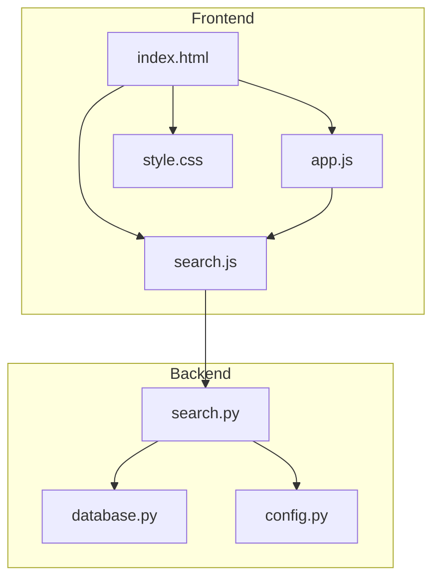
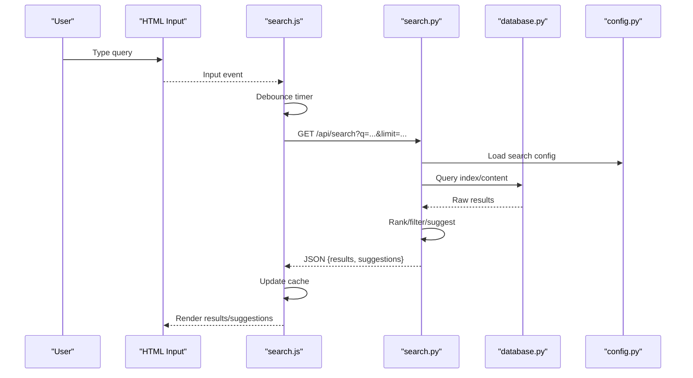
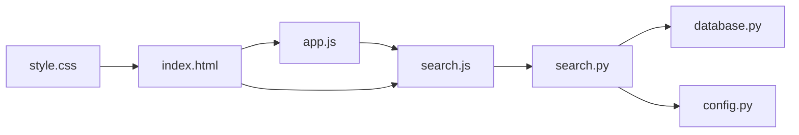

# Search Functionality

<cite>
**Referenced Files in This Document**
- [search.js](file://carrot/web/js/search.js)
- [app.js](file://carrot/web/js/app.js)
- [index.html](file://carrot/web/index.html)
- [style.css](file://carrot/web/css/style.css)
- [search.py](file://carrot/search.py)
- [database.py](file://carrot/database.py)
- [config.py](file://carrot/config.py)
</cite>

## Table of Contents
1. [Introduction](#introduction)
2. [Project Structure](#project-structure)
3. [Core Components](#core-components)
4. [Architecture Overview](#architecture-overview)
5. [Detailed Component Analysis](#detailed-component-analysis)
6. [Dependency Analysis](#dependency-analysis)
7. [Performance Considerations](#performance-considerations)
8. [Troubleshooting Guide](#troubleshooting-guide)
9. [Conclusion](#conclusion)

## Introduction
This document explains the search feature implementation across the web frontend and backend. It covers the search algorithm, indexing strategy, query processing logic, user interaction patterns (including real-time suggestions), result filtering, performance optimization, caching strategies, and error handling for failed or empty results. The goal is to provide both a high-level understanding and code-level references so that developers can extend or troubleshoot the search functionality effectively.

## Project Structure
The search feature spans the frontend and backend:
- Frontend: HTML page with a search input, JavaScript modules for UI behavior and API calls, and CSS styling.
- Backend: Python module implementing search logic, database access, and configuration.

**Diagram sources**
- [index.html](file://carrot/web/index.html)
- [app.js](file://carrot/web/js/app.js)
- [search.js](file://carrot/web/js/search.js)
- [style.css](file://carrot/web/css/style.css)
- [search.py](file://carrot/search.py)
- [database.py](file://carrot/database.py)
- [config.py](file://carrot/config.py)

**Section sources**
- [index.html](file://carrot/web/index.html)
- [app.js](file://carrot/web/js/app.js)
- [search.js](file://carrot/web/js/search.js)
- [style.css](file://carrot/web/css/style.css)
- [search.py](file://carrot/search.py)
- [database.py](file://carrot/database.py)
- [config.py](file://carrot/config.py)

## Core Components
- Frontend search controller: Handles user input, debouncing, API requests, and rendering results.
- Backend search service: Implements search algorithms, indexing, and query processing; interacts with the database and configuration.
- Data layer: Database abstraction used by the backend to retrieve indexed content.
- Configuration: Centralized settings for search behavior, limits, and features.

Key responsibilities:
- Debounce rapid keystrokes to reduce network load.
- Build and send queries to the backend search endpoint.
- Render suggestions and results with filtering options.
- Cache recent queries and results to improve responsiveness.
- Handle errors gracefully and display meaningful messages.

**Section sources**
- [search.js](file://carrot/web/js/search.js)
- [app.js](file://carrot/web/js/app.js)
- [search.py](file://carrot/search.py)
- [database.py](file://carrot/database.py)
- [config.py](file://carrot/config.py)

## Architecture Overview
The search architecture follows a client-server pattern:
- The frontend captures user input and triggers debounced searches.
- The backend processes queries using an index and returns ranked results or suggestions.
- Results are rendered in the UI with optional filters applied client-side.

**Diagram sources**
- [search.js](file://carrot/web/js/search.js)
- [search.py](file://carrot/search.py)
- [database.py](file://carrot/database.py)
- [config.py](file://carrot/config.py)

## Detailed Component Analysis

### Frontend Search Controller (search.js)
Responsibilities:
- Debounce input events to avoid excessive requests.
- Construct API requests with query parameters (e.g., q, limit).
- Manage local caches for recent queries and results.
- Render suggestions and results into the DOM.
- Apply client-side filters (e.g., type, date range).
- Handle network errors and empty results.

Search API integration:
- Uses fetch or XMLHttpRequest to call the backend search endpoint.
- Parses JSON responses and updates the UI accordingly.

Debouncing technique:
- Maintains a timer per input session; cancels previous timers on new keystrokes.
- Ensures only the latest query triggers a request after a delay.

Result presentation:
- Dynamically creates list items or cards for each result.
- Highlights matching terms within titles/snippets.
- Provides quick actions (open, filter, clear).

Error handling:
- Displays user-friendly messages for network failures or timeouts.
- Shows “no results” state when the response contains no matches.

Caching strategy:
- Stores recent queries and their results in memory.
- Reuses cached results for identical queries to speed up interactions.

Filtering mechanisms:
- Client-side filtering refines displayed results without additional server calls.
- Supports toggles for categories, tags, or recency.

**Section sources**
- [search.js](file://carrot/web/js/search.js)

### Backend Search Service (search.py)
Responsibilities:
- Implement search algorithms (keyword matching, ranking, suggestion generation).
- Maintain or query an index structure for fast retrieval.
- Process query normalization (lowercasing, tokenization, stop words).
- Return structured responses including results and suggestions.

Indexing strategy:
- Builds an inverted index mapping tokens to document IDs and positions.
- Optionally stores metadata (title, snippet, category, timestamp) for filtering and sorting.

Query processing logic:
- Normalizes input text and splits into tokens.
- Matches tokens against the index and computes relevance scores.
- Applies filters (category, date range) and sorts by relevance or recency.

API endpoints:
- Exposes endpoints for search queries and suggestions.
- Accepts parameters like query string, limit, offset, and filters.

Error handling:
- Returns appropriate HTTP status codes for invalid inputs or internal errors.
- Logs exceptions and provides safe fallback responses.

**Section sources**
- [search.py](file://carrot/search.py)

### Data Layer (database.py)
Responsibilities:
- Provide abstractions for querying indexed data.
- Support efficient retrieval by token, ID, or metadata filters.
- Ensure consistent schema for documents and metadata.

Data models:
- Documents include fields such as id, title, content, category, and timestamps.
- Index entries map tokens to lists of document references.

Performance considerations:
- Use indexes and pagination to minimize payload sizes.
- Optimize queries with selective field retrieval.

**Section sources**
- [database.py](file://carrot/database.py)

### Configuration (config.py)
Responsibilities:
- Define search defaults (max results, suggestion count).
- Toggle features like fuzzy matching or advanced filters.
- Configure timeouts and retry policies for network requests.

Settings examples:
- Limits for results and suggestions.
- Flags enabling/disabling caching or advanced ranking.

**Section sources**
- [config.py](file://carrot/config.py)

### UI Integration (index.html and style.css)
Responsibilities:
- Provide the search input element and containers for results/suggestions.
- Style the search interface for clarity and responsiveness.

Interaction points:
- Bind input events to the frontend search controller.
- Display loading indicators during search operations.

**Section sources**
- [index.html](file://carrot/web/index.html)
- [style.css](file://carrot/web/css/style.css)

## Dependency Analysis
The search feature has clear dependencies between frontend and backend components:
- Frontend depends on the backend search API for data.
- Backend depends on the database layer for indexed content.
- Configuration influences both frontend behavior and backend processing.

**Diagram sources**
- [search.js](file://carrot/web/js/search.js)
- [app.js](file://carrot/web/js/app.js)
- [index.html](file://carrot/web/index.html)
- [style.css](file://carrot/web/css/style.css)
- [search.py](file://carrot/search.py)
- [database.py](file://carrot/database.py)
- [config.py](file://carrot/config.py)

**Section sources**
- [search.js](file://carrot/web/js/search.js)
- [app.js](file://carrot/web/js/app.js)
- [index.html](file://carrot/web/index.html)
- [style.css](file://carrot/web/css/style.css)
- [search.py](file://carrot/search.py)
- [database.py](file://carrot/database.py)
- [config.py](file://carrot/config.py)

## Performance Considerations
Optimization techniques implemented or recommended:
- Debouncing input to reduce request frequency.
- Caching recent queries and results in memory to avoid repeated network calls.
- Limiting result sets via configurable limits to minimize payload size.
- Using efficient indexing structures (inverted index) for fast lookups.
- Applying client-side filters to refine results without extra server requests.
- Enabling pagination or incremental loading for large result sets.
- Configuring timeouts and retries to handle transient network issues.

[No sources needed since this section provides general guidance]

## Troubleshooting Guide
Common issues and resolutions:
- Empty results:
  - Verify query normalization and tokenization.
  - Check index completeness and ensure documents are indexed correctly.
  - Confirm filters are not overly restrictive.
- Network errors:
  - Inspect backend logs for exceptions.
  - Validate API endpoint availability and CORS settings if applicable.
  - Increase timeout values or implement retry logic.
- Slow performance:
  - Review debounce intervals and cache hit rates.
  - Optimize database queries and index usage.
  - Reduce result set sizes and enable pagination.
- UI feedback:
  - Ensure loading states and error messages are visible.
  - Provide clear “no results” prompts and suggestions to refine queries.

**Section sources**
- [search.js](file://carrot/web/js/search.js)
- [search.py](file://carrot/search.py)

## Conclusion
The search feature combines a responsive frontend with a robust backend to deliver fast, relevant results and suggestions. By leveraging debouncing, caching, efficient indexing, and client-side filtering, it balances performance and usability. Proper error handling and clear UI feedback ensure a smooth user experience even under failure conditions. Extending the feature involves enhancing the index, refining ranking algorithms, and adding richer filters while maintaining performance and reliability.