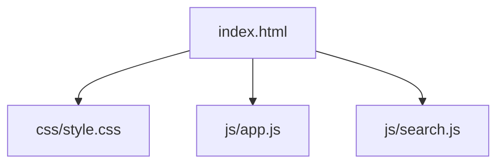
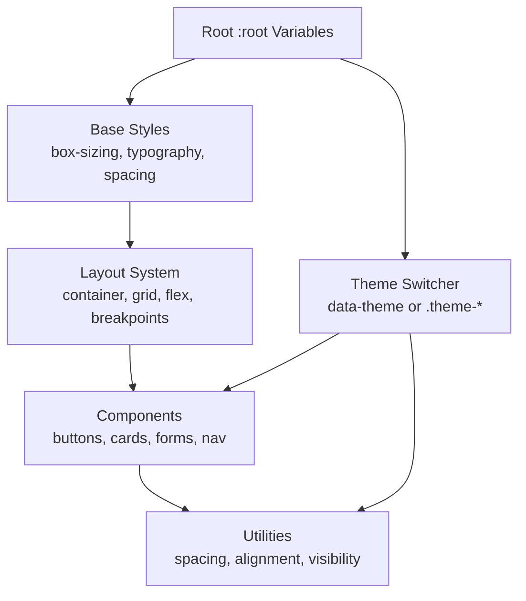
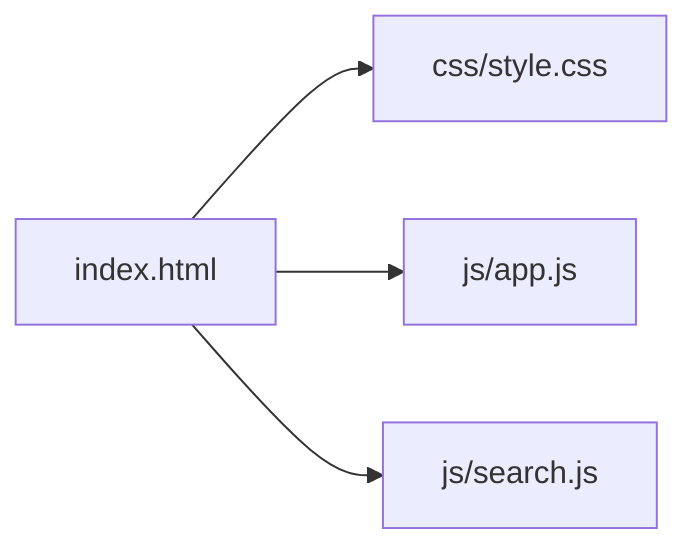

# Styling and Theming

<cite>
**Referenced Files in This Document**
- [style.css](file://carrot/web/css/style.css)
- [index.html](file://carrot/web/index.html)
</cite>

## Table of Contents
1. [Introduction](#introduction)
2. [Project Structure](#project-structure)
3. [Core Components](#core-components)
4. [Architecture Overview](#architecture-overview)
5. [Detailed Component Analysis](#detailed-component-analysis)
6. [Dependency Analysis](#dependency-analysis)
7. [Performance Considerations](#performance-considerations)
8. [Troubleshooting Guide](#troubleshooting-guide)
9. [Conclusion](#conclusion)

## Introduction
This document explains the styling and theming system used by the web interface. It covers stylesheet organization, CSS custom properties for theming, responsive design patterns, mobile-first approach, color schemes, typography systems, layout frameworks, component styling conventions, customization workflows, cross-screen consistency, browser compatibility, and performance optimization techniques.

## Project Structure
The web layer is organized under a dedicated directory with a single primary stylesheet and an HTML entry point:
- Web root: carrot/web
  - index.html: main page that loads styles and scripts
  - css/style.css: global styles, theme variables, responsive rules, and component styles
  - js/app.js and js/search.js: client-side logic (not covered here)

**Diagram sources**
- [index.html](file://carrot/web/index.html)
- [style.css](file://carrot/web/css/style.css)

**Section sources**
- [index.html](file://carrot/web/index.html)
- [style.css](file://carrot/web/css/style.css)

## Core Components
The styling system centers around:
- Global CSS custom properties for colors, typography, spacing, shadows, and breakpoints
- Mobile-first base styles with progressive enhancement via media queries
- Utility-like classes for consistent spacing and layout
- Component-level styles scoped to semantic class names
- Dark/light theme toggling through data attributes or class-based overrides

Key responsibilities:
- style.css defines tokens and base styles, then layers components and responsive rules
- index.html wires up the stylesheet and ensures correct viewport settings

**Section sources**
- [style.css](file://carrot/web/css/style.css)
- [index.html](file://carrot/web/index.html)

## Architecture Overview
The styling architecture follows a token-driven, layered approach:
- Tokens: CSS custom properties define design primitives (colors, fonts, radii, shadows)
- Base: Reset/normalize, typography scale, spacing scale, and global box model
- Layout: Container, grid/flex utilities, and responsive breakpoints
- Components: Buttons, cards, forms, navigation, and other UI elements
- Utilities: Small helper classes for margin/padding, text alignment, visibility, etc.
- Themes: Light/dark palettes applied via data-theme attribute or class toggling

[No sources needed since this diagram shows conceptual workflow, not actual code structure]

## Detailed Component Analysis

### Theme Tokens and Custom Properties
- Centralize all design tokens as CSS custom properties on :root
- Provide light and dark variants using a data-theme attribute on <html> or <body>
- Group tokens logically:
  - Colors: background, surface, text, border, accent, success, warning, error
  - Typography: font-family, font-size scale, line-height, letter-spacing
  - Spacing: scale for padding/margins and gaps
  - Elevation: shadow tokens for depth
  - Borders: radius tokens for rounded corners
  - Breakpoints: named variables for responsive thresholds

Best practices:
- Use semantic names (e.g., --color-surface, --color-text-primary)
- Keep values consistent across themes
- Avoid hardcoding colors in components; reference tokens only

Example usage pattern:
- Apply tokens via var(--token-name)
- Override at scope level when necessary
- Maintain fallbacks for older browsers

**Section sources**
- [style.css](file://carrot/web/css/style.css)

### Color Schemes
- Define palettes per theme using CSS custom properties
- Ensure sufficient contrast ratios for accessibility
- Provide utility classes for common color applications (text, backgrounds, borders)
- Support high-contrast mode where applicable

Accessibility considerations:
- Validate contrast against WCAG guidelines
- Offer focus states distinct from default colors
- Avoid relying solely on color to convey meaning

**Section sources**
- [style.css](file://carrot/web/css/style.css)

### Typography System
- Establish a type scale with modular sizing (e.g., 0.833, 1, 1.2, 1.5, 2)
- Set base font family and fallback stacks
- Define headings, body, captions, and code styles
- Control line-height and letter-spacing for readability
- Use relative units (rem/em) for scalable text

Consistency tips:
- Reuse tokens for font sizes and line heights
- Limit the number of typefaces to two at most
- Ensure legible minimum sizes on small screens

**Section sources**
- [style.css](file://carrot/web/css/style.css)

### Layout Framework
- Mobile-first base styles with container constraints
- Flexbox and Grid for layouts
- Named breakpoints stored as variables
- Consistent spacing via gap and padding tokens

Responsive strategy:
- Start with single-column layouts
- Introduce multi-column layouts at appropriate breakpoints
- Use fluid spacing and flexible containers

**Section sources**
- [style.css](file://carrot/web/css/style.css)

### Component Styling Conventions
- Scope styles to semantic class names (e.g., .btn, .card, .form-group)
- Use tokens for colors, spacing, and typography within components
- Maintain consistent interaction states (hover, focus, active, disabled)
- Provide accessible markup patterns and ARIA attributes where needed

Common patterns:
- Button variants (primary, secondary, ghost) via modifier classes
- Card composition with header, body, footer sections
- Form inputs with labels, helpers, and validation states

**Section sources**
- [style.css](file://carrot/web/css/style.css)

### Responsive Design Patterns
- Mobile-first media queries
- Fluid typography and images
- Flexible grids and stacking behavior
- Touch-friendly targets and spacing

Breakpoint guidance:
- Use tokens for breakpoint values
- Test at common device widths
- Prioritize content hierarchy across sizes

**Section sources**
- [style.css](file://carrot/web/css/style.css)

### Mobile-First Approach
- Base styles target small screens
- Enhance progressively with larger breakpoints
- Optimize performance by avoiding heavy styles on mobile
- Ensure touch interactions are smooth and accessible

**Section sources**
- [style.css](file://carrot/web/css/style.css)

### Theme Switching Workflow
- Toggle data-theme attribute on <html> or <body>
- Define light and dark token sets
- Update component styles via token references
- Persist user preference in localStorage if supported

Implementation outline:
- Add a toggle control in the UI
- On change, set data-theme="dark" or "light"
- Ensure all components consume tokens consistently

**Section sources**
- [style.css](file://carrot/web/css/style.css)
- [index.html](file://carrot/web/index.html)

### Adding New Styles
Guidelines:
- Place new tokens in the theme section
- Create component-specific blocks under a clearly labeled section
- Follow naming conventions and avoid specificity wars
- Include hover, focus, and disabled states
- Add responsive adjustments if needed

Checklist:
- Uses tokens?
- Accessible states?
- Responsive behavior?
- No hardcoded values?

**Section sources**
- [style.css](file://carrot/web/css/style.css)

### Maintaining Consistency Across Screen Sizes
- Use relative units and tokens
- Test key breakpoints thoroughly
- Prefer fluid layouts over fixed widths
- Validate contrast and readability at all sizes

**Section sources**
- [style.css](file://carrot/web/css/style.css)

## Dependency Analysis
Styles are loaded by the HTML entry point. The CSS file is self-contained and may be extended with additional files in the future. Scripts do not directly depend on CSS but may toggle theme-related attributes.

**Diagram sources**
- [index.html](file://carrot/web/index.html)
- [style.css](file://carrot/web/css/style.css)

**Section sources**
- [index.html](file://carrot/web/index.html)
- [style.css](file://carrot/web/css/style.css)

## Performance Considerations
- Minify and concatenate CSS for production
- Defer non-critical styles or use media queries to load conditionally
- Avoid large selectors and deep nesting
- Use CSS containment where appropriate
- Leverage browser caching with cache headers
- Remove unused styles during build
- Prefer hardware-accelerated properties for animations
- Keep critical CSS inline for above-the-fold content if needed

Optimization checklist:
- Critical CSS inlined?
- Unused CSS removed?
- Images optimized and responsive?
- Fonts preloaded and subsetted?

[No sources needed since this section provides general guidance]

## Troubleshooting Guide
Common issues and resolutions:
- Theme not applying: ensure data-theme attribute is set correctly and tokens are referenced everywhere
- Inconsistent colors: verify no hardcoded values override tokens
- Broken layouts on mobile: check media query ranges and container constraints
- Accessibility problems: validate contrast and focus states
- Performance regressions: audit selector complexity and render-blocking resources

Debugging steps:
- Inspect computed styles and token values
- Temporarily disable media queries to isolate issues
- Use browser dev tools to measure rendering performance

**Section sources**
- [style.css](file://carrot/web/css/style.css)
- [index.html](file://carrot/web/index.html)

## Conclusion
A robust styling and theming system relies on well-defined tokens, a clear layering strategy, and a mobile-first mindset. By centralizing design decisions in CSS custom properties, enforcing consistent component patterns, and optimizing delivery, the interface remains maintainable, accessible, and performant across devices and themes.

[No sources needed since this section summarizes without analyzing specific files]