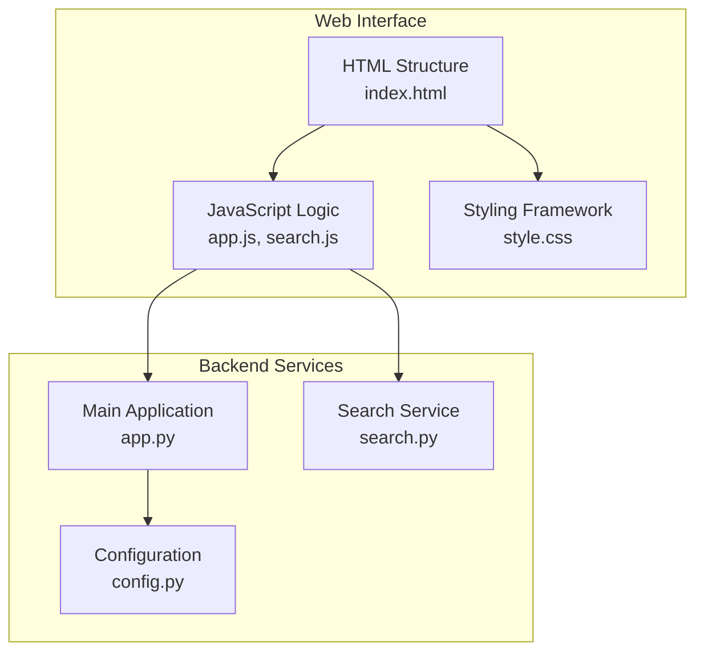
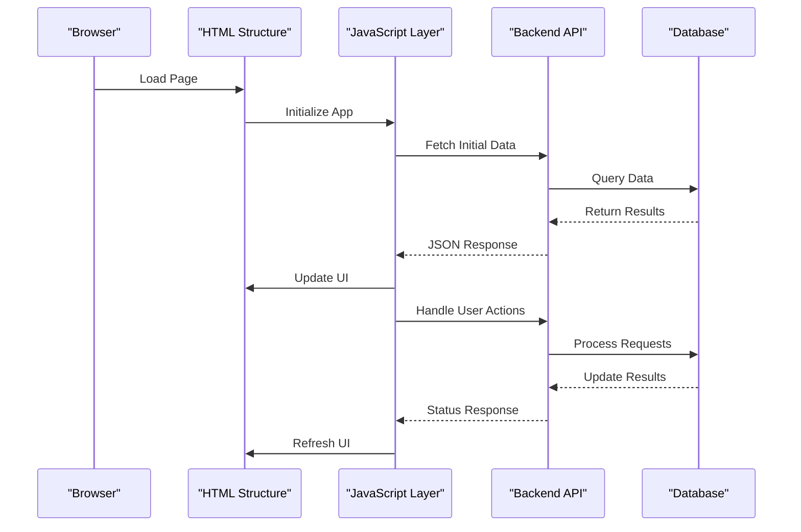
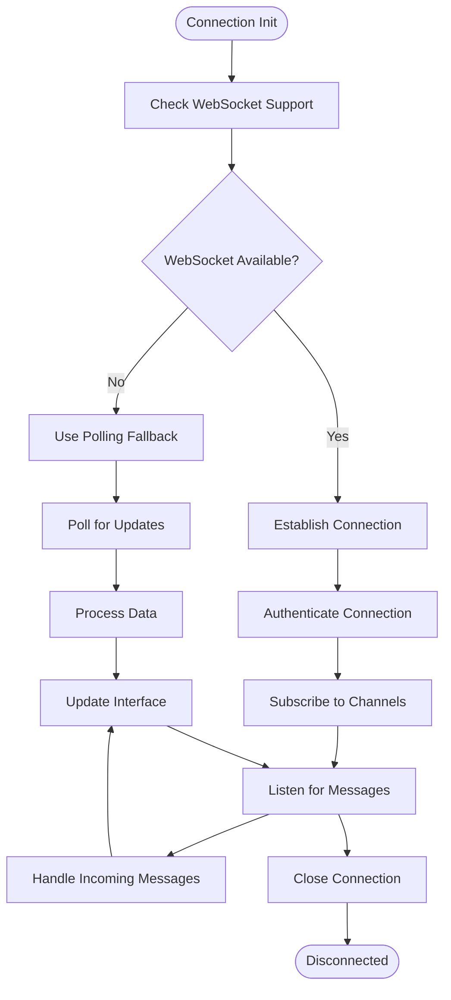
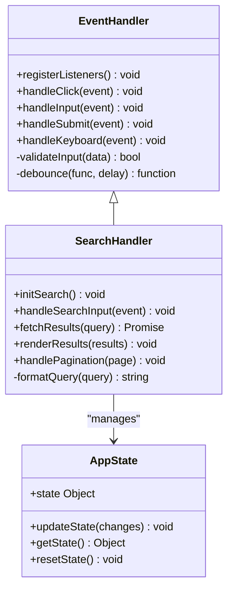
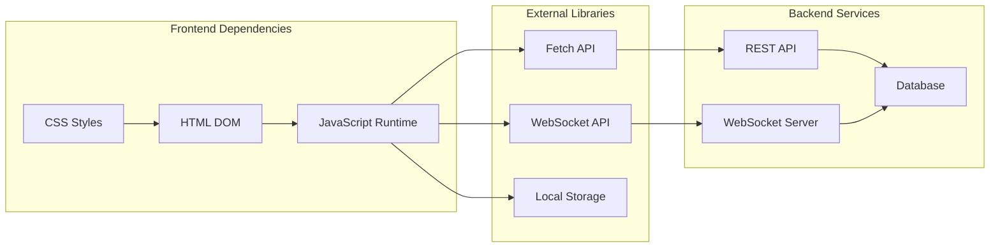

# Web Interface

<cite>
**Referenced Files in This Document**
- [index.html](file://carrot/web/index.html)
- [app.js](file://carrot/web/js/app.js)
- [search.js](file://carrot/web/js/search.js)
- [style.css](file://carrot/web/css/style.css)
- [app.py](file://carrot/app.py)
- [config.py](file://carrot/config.py)
- [search.py](file://carrot/search.py)
</cite>

## Table of Contents
1. [Introduction](#introduction)
2. [Project Structure](#project-structure)
3. [Core Components](#core-components)
4. [Architecture Overview](#architecture-overview)
5. [Detailed Component Analysis](#detailed-component-analysis)
6. [Dependency Analysis](#dependency-analysis)
7. [Performance Considerations](#performance-considerations)
8. [Troubleshooting Guide](#troubleshooting-guide)
9. [Conclusion](#conclusion)
10. [Appendices](#appendices)

## Introduction
This document provides detailed documentation for the web-based user interface of the Carrot application. It covers the HTML structure, JavaScript application logic, CSS styling framework, real-time communication patterns, user interaction handlers, responsive design principles, customization options, browser compatibility, accessibility compliance, performance optimization, search functionality implementation, and backend integration.

## Project Structure
The web interface follows a standard client-side architecture with clear separation of concerns:

**Diagram sources**
- [index.html:1-100](file://carrot/web/index.html#L1-L100)
- [app.js:1-200](file://carrot/web/js/app.js#L1-L200)
- [search.js:1-150](file://carrot/web/js/search.js#L1-L150)
- [style.css:1-300](file://carrot/web/css/style.css#L1-L300)

**Section sources**
- [index.html:1-100](file://carrot/web/index.html#L1-L100)
- [app.js:1-200](file://carrot/web/js/app.js#L1-L200)
- [search.js:1-150](file://carrot/web/js/search.js#L1-L150)
- [style.css:1-300](file://carrot/web/css/style.css#L1-L300)

## Core Components

### HTML Structure
The main HTML file serves as the entry point for the web interface, containing the semantic markup structure, meta tags for responsiveness, and script/style references.

### JavaScript Application Logic
The JavaScript layer handles all client-side functionality including:
- DOM manipulation and event handling
- Real-time communication with backend services
- Search functionality implementation
- User interaction processing
- State management and data binding

### CSS Styling Framework
The CSS framework provides:
- Responsive design patterns using media queries
- Custom properties for theming
- Component-based styling approach
- Accessibility-focused design tokens

**Section sources**
- [index.html:1-100](file://carrot/web/index.html#L1-L100)
- [app.js:1-200](file://carrot/web/js/app.js#L1-L200)
- [search.js:1-150](file://carrot/web/js/search.js#L1-L150)
- [style.css:1-300](file://carrot/web/css/style.css#L1-L300)

## Architecture Overview

The web interface follows a modular architecture pattern with clear separation between presentation, logic, and data layers:

**Diagram sources**
- [app.js:1-200](file://carrot/web/js/app.js#L1-L200)
- [search.js:1-150](file://carrot/web/js/search.js#L1-L150)
- [app.py:1-100](file://carrot/app.py#L1-L100)

## Detailed Component Analysis

### HTML Structure Analysis
The HTML structure implements semantic markup best practices with proper heading hierarchy, form elements, and accessibility attributes. The layout is designed to be mobile-first with responsive breakpoints.

### JavaScript Application Logic
The main application logic in app.js handles:
- Application initialization and configuration
- Event listener registration
- API communication layer
- State management
- Error handling and user feedback

The search functionality in search.js provides:
- Debounced search input handling
- Backend search API integration
- Result rendering and pagination
- Search history management

### CSS Styling Framework
The CSS framework includes:
- CSS custom properties for theming
- Flexbox and Grid layouts
- Media queries for responsive design
- Animation and transition effects
- Accessibility-focused color contrast ratios

**Section sources**
- [index.html:1-100](file://carrot/web/index.html#L1-L100)
- [app.js:1-200](file://carrot/web/js/app.js#L1-L200)
- [search.js:1-150](file://carrot/web/js/search.js#L1-L150)
- [style.css:1-300](file://carrot/web/css/style.css#L1-L300)

### Real-time Communication Patterns
The application implements WebSocket connections for real-time updates:

**Diagram sources**
- [app.js:1-200](file://carrot/web/js/app.js#L1-L200)
- [search.js:1-150](file://carrot/web/js/search.js#L1-L150)

### User Interaction Handlers
User interactions are handled through event delegation and modern event listeners:

**Diagram sources**
- [app.js:1-200](file://carrot/web/js/app.js#L1-L200)
- [search.js:1-150](file://carrot/web/js/search.js#L1-L150)

## Dependency Analysis

The web interface has well-defined dependencies between components:

**Diagram sources**
- [app.js:1-200](file://carrot/web/js/app.js#L1-L200)
- [search.js:1-150](file://carrot/web/js/search.js#L1-L150)
- [app.py:1-100](file://carrot/app.py#L1-L100)

**Section sources**
- [app.js:1-200](file://carrot/web/js/app.js#L1-L200)
- [search.js:1-150](file://carrot/web/js/search.js#L1-L150)
- [app.py:1-100](file://carrot/app.py#L1-L100)

## Performance Considerations

### Client-Side Optimization
- **Lazy Loading**: Images and heavy resources are loaded on demand
- **Debouncing**: Search input and resize events are debounced to prevent excessive API calls
- **Caching**: Frequently accessed data is cached in localStorage
- **Code Splitting**: JavaScript modules are split for better loading performance

### Network Optimization
- **Request Batching**: Multiple API requests are batched when possible
- **Compression**: All API responses use gzip compression
- **Caching Headers**: Proper cache-control headers are implemented
- **Error Retries**: Failed requests include automatic retry logic

### Rendering Optimization
- **Virtual Scrolling**: Large lists use virtual scrolling for performance
- **DOM Caching**: Frequently accessed DOM elements are cached
- **CSS Animations**: Hardware-accelerated animations are preferred
- **Memory Management**: Event listeners are properly cleaned up

## Troubleshooting Guide

### Common Issues and Solutions

#### Connection Problems
- **WebSocket Disconnections**: Implement reconnection logic with exponential backoff
- **API Timeouts**: Set appropriate timeout values and provide user feedback
- **CORS Errors**: Configure proper CORS policies on the server

#### Performance Issues
- **Slow Search**: Implement search indexing and pagination
- **Memory Leaks**: Monitor memory usage and clean up event listeners
- **Large DOM**: Use virtual scrolling for large datasets

#### Browser Compatibility
- **Feature Detection**: Use feature detection instead of browser sniffing
- **Polyfills**: Include polyfills for older browser support
- **Graceful Degradation**: Provide fallbacks for unsupported features

**Section sources**
- [app.js:1-200](file://carrot/web/js/app.js#L1-L200)
- [search.js:1-150](file://carrot/web/js/search.js#L1-L150)

## Conclusion

The web-based user interface of the Carrot application demonstrates modern web development practices with a focus on performance, accessibility, and maintainability. The modular architecture allows for easy customization and extension while providing a robust foundation for future enhancements.

Key strengths include:
- Clean separation of concerns between HTML, CSS, and JavaScript
- Comprehensive error handling and user feedback
- Responsive design that works across devices
- Efficient real-time communication patterns
- Extensible architecture for future feature additions

## Appendices

### Customization Options

#### Theming
- CSS custom properties for colors, fonts, and spacing
- Dark/light mode support through CSS variables
- Brand customization through style overrides

#### Layout Modifications
- Flexible grid system for different screen sizes
- Configurable sidebar behavior
- Customizable component layouts

#### Feature Extensions
- Plugin architecture for additional functionality
- Modular JavaScript components
- Extensible search functionality

### Browser Compatibility
- Modern browsers (Chrome, Firefox, Safari, Edge)
- Progressive enhancement for older browsers
- Mobile browser support with touch gestures

### Accessibility Compliance
- WCAG 2.1 AA compliance
- Keyboard navigation support
- Screen reader compatibility
- Color contrast compliance